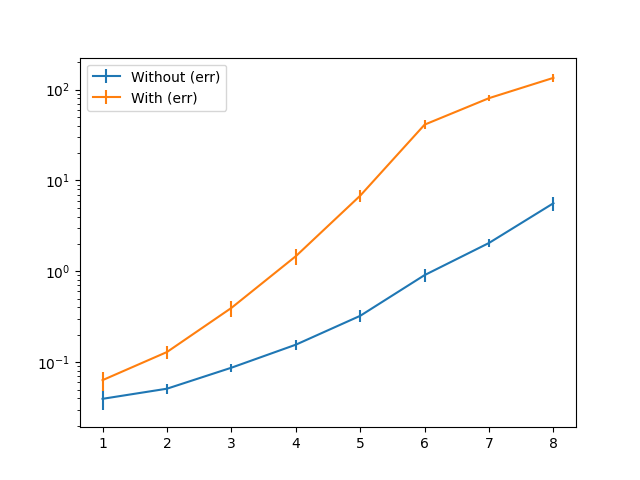
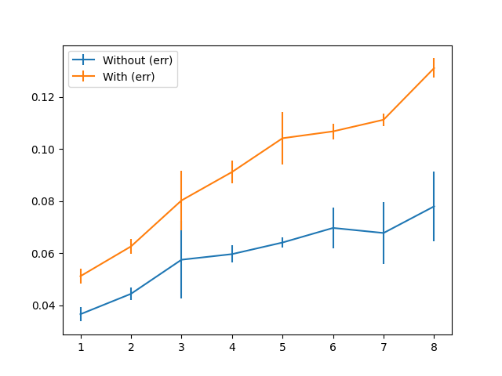

# tracing-exponential
Demonstrates exponential compile times in rust's tracing package.

The python script `do_timing.py` generates a module with a chain of 10 async
functions calling each other, and adds `#[instrument]` to `n` of these
functions.  Then it compiles the package. Averaging over 10 compiles and
subtracting the compile time for 0 statements, we compile times that look
exponential in the number of `#[instrument]` statements (note the logarithmic y
axis):

If we replace `#[instrument]` by `#[instrument(err)]`, compile times increase
drastically.

Removing `async/await` removes the slowdown, giving linear compile times (note the
linear y axis):

